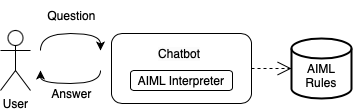
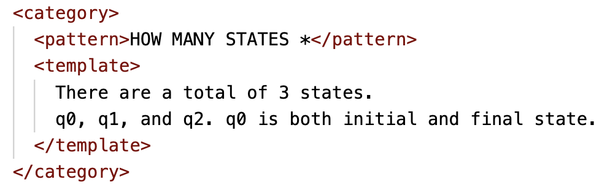

# NoVAGraphS
*future link to the published paper and brief description*

# Dialogue System based on AIML for Finite State Automata

The Dialogue System (DS) proposed in this project is built upon AIML, a declarative language designed for the easy implementation of DSs using the pattern-matching paradigm.

While Large Language Models have shown inconsistencies and generated hallucinated information on Finite State Automata (FSA), rule-based systems offer consistent and controlled responses by design, though they may lack flexibility and scalability. 
However, rule-based DSs allow us to explore the hypothesis that a dialogue-based interaction is more effective than a graphical representation for Visually Impaired People.

## Implementation and Design

We implemented two specific FSA descriptions in AIML and designed the *happy paths*—prototypical dialogues where the DS provides all requested information [ref](http://xunitpatterns.com/happy%20path.html). For precise descriptions of FSA terminology, definitions, and procedures, we relied on an influential textbook on formal languages providing a comprehensive introduction to automata theory [ref](https://en.wikipedia.org/wiki/Introduction_to_Automata_Theory,_Languages,_and_Computation).



*Figure 1: System Architecture*


The DS workflow involves the following steps (see Figure 1): the user submits a question, preprocessed by removing special characters and whitespaces. The AIML Interpreter searches for the corresponding AIML rule to trigger, and the DS retrieves and sends back the answer. The DS is developed using Node.js and the open-source library aiml-high [source](https://github.com/gleuch/aiml-high) to interpret AIML rules.



*Figure 2: AIML Rule Example*

As an example, Figure 2 shows the most-used rule in the experimentation we conducted, triggering answers to questions like: *How many states are there?*, *How many states does the automaton have?*. This rule captures questions starting with *How many states* followed by one or more words.

## Getting Started

### Initial Setup (First Time Only)
1. Install Node.js
2. Open a terminal in the project folder.
3. Run the following command to install the necessary dependencies:
   ```bash
   npm install express-session

### Running the Application
1. Open a terminal in the project folder.
2. Run the following command to install the necessary dependencies:
   ```bash
   node app.js
